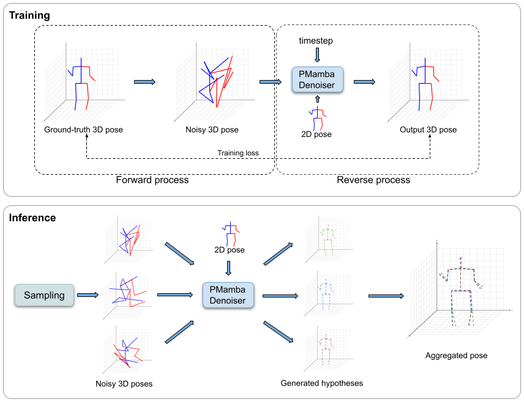
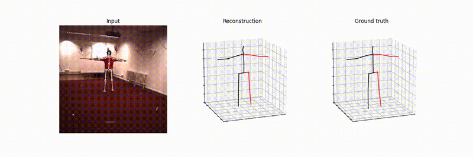

# MHDPose: Multi-hypothesis 3D human pose estimation using bidirectional Mamba diffusion models

Code for MHDPose, a diffusion-based framework for 3D human pose estimation, benchmarked against a wide range of recent baselines on Human3.6M and MPI-INF-3DHP.

**Paper:** [Link to the paper](https://www.sciencedirect.com/science/article/pii/S0031320326013610)

### Multi-hypotheses pose estimation:

<p align="center">
  
  
</p>


### Demo Video

Below is a short demo of the model output:

<video src="visuals/representative_video.mp4" controls width="800"></video>
<p align="center">
  
</p>

[Watch the full MP4 video](visuals/representative_video.mp4)


Code will be published soon.

## Citation

If you find this repository useful, please consider citing our work:

```bibtex
@article{KAPPAN2026114396,
title = {MHDPose: Multi-hypothesis 3D human pose estimation using bidirectional Mamba diffusion models},
journal = {Pattern Recognition},
pages = {114396},
year = {2026},
issn = {0031-3203},
doi = {https://doi.org/10.1016/j.patcog.2026.114396},
url = {https://www.sciencedirect.com/science/article/pii/S0031320326013610},
author = {Marsha Mariya Kappan and Eduardo Benitez Sandoval and Erik Meijering and Francisco Cruz},
}
```


## Acknowledgements

This project refers to and builds upon ideas/code from the following repositories:

- [VideoPose3D](https://github.com/facebookresearch/VideoPose3D)
- [D3DP](https://github.com/paTRICK-swk/D3DP/tree/main)
- [MixSTE](https://github.com/JinluZhang1126/MixSTE)
- [video-to-pose3D](https://github.com/zh-plus/video-to-pose3D)

We sincerely thank the authors of these repositories for releasing their code and making their work publicly available.
